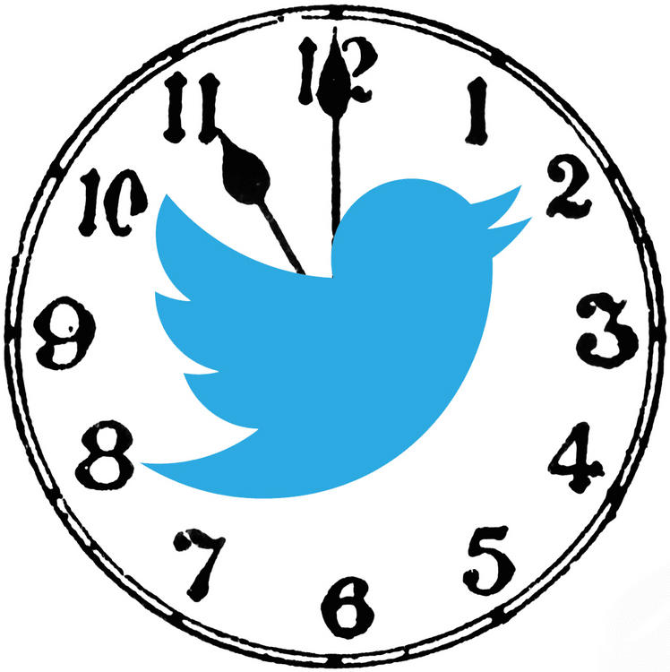

# __Project: :kronoTweeter__
---

Hopefully the first of many Twitter modules I hope to build into an application suite using the Twitter API.

**Purpose**
To generate an application that will act either as a bot or just a scheduled Tweet Application. Whichever trips your trigger, I suppose. My purpose in creating this application is to hone and sharpen my Ruby on Rails skills as well as learn about other methods of problem solving in the process.

Bibliography:
* Sitepoint Tutorial
http://www.sitepoint.com/rails-authentication-oauth-2-0-omniauth/
* Twitter API Gem Tutorial
http://blog.benmorgan.io/post/79339120263/how-to-use-the-twitter-api-for-ruby-on-rails
* Stack Overflow Posts
  * https://stackoverflow.com/questions/33139275/error-on-migration-sqlite3sqlexception-no-such-table-main-users
  * https://stackoverflow.com/questions/33200143/undefined-local-variable-or-method-oauth-token-when-sending-tweets-from-rails
* Make a Twitter Bot
http://www.mattmorgante.com/technology/505
* Sending a Tweet to Twitter
https://richonrails.com/articles/sending-a-tweet-to-twitter
* Custom Rake tasks
http://railscasts.com/episodes/66-custom-rake-tasks
